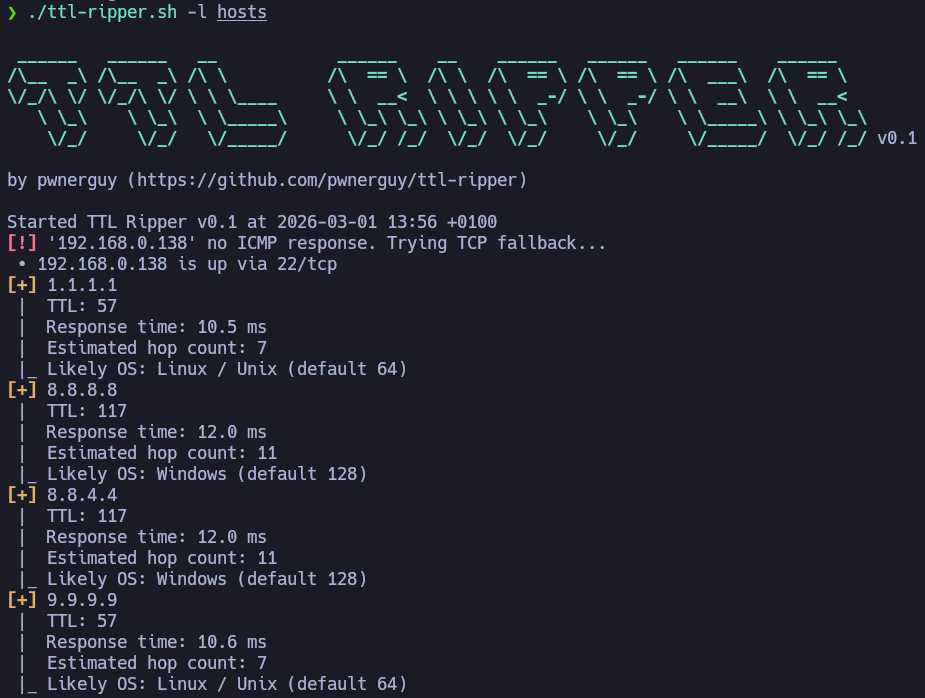
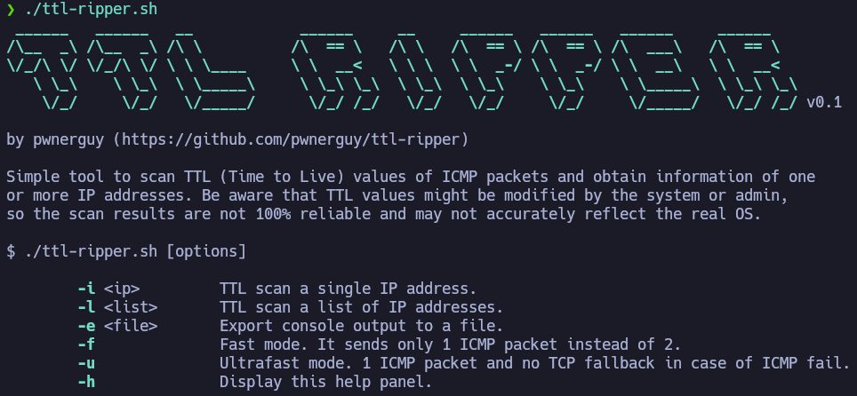

# TTL Ripper v0.1

**TTL Ripper** is a simple tool to scan TTL (Time to Live) values of ICMP packets to gather information about one or more IP addresses. It includes fast mode, ultrafast mode y and an optional TCP fallback for hosts that don't respond to ICMP.




# How does it work?

TTL Ripper sends ICMP packets and analyzes the returned TTL value.

| **TTL** | **Likely OS**                           |
| ------- | --------------------------------------- |
| 64      | Linux / Unix                            |
| 128     | Windows                                 |
| 255     | BSD / Solaris / Network devices / Other |

Every router decreases the TTL value by one when forwarding a packet. If you know the default TTL (64, 128, 255...), you can estimate the hop count as:

```
hops = default_TTL - received_TTL
```

This method is not 100% accurate, since some systems or admins modify the default TTL.

If the packet is lost or the host doesn't reply, the host will be marked as down and a TCP fallback will be attempted. This fallback consists of making quick connections attempts to several popular TCP ports to determinate wether the host is actually up.

# Installation

```bash
git clone https://github.com/pwnerguy/ttl-ripper
cd ttl-ripper
chmod +x ttl-ripper.sh
```

# Usage



### Scan a single IP address

```bash
./ttl-ripper.sh -i 192.168.1.1
```

### Scan a list of IP addresses

```bash
./ttl-ripper.sh -l hosts
```

- Supported list formats:

```
<ip>
<ip>
<ip>
...
```

```
<ip> <ip> <ip> ...
```


### Export results

```bash
./ttl-ripper.sh -l hosts -e scan_output.txt
```


### Fast mode 

-  Sends 1 ICMP packet instead of 2. 

```bash
./ttl-ripper.sh -l hosts -f
```


### Ultrafast mode

-  Faster and stealthier
-  Sends 1 ICMP packet.
-  If the host doesn't reply, it's marked as down without TCP fallback.

```bash
./ttl-ripper.sh -l hosts -u
```


# Limitations

-  TTL values might be modified by systems or admins.
-  Results are not 100% reliable and may not accurately reflect the real OS.
-  IPv6 is not supported.
 - Not a replacement for Nmap.
